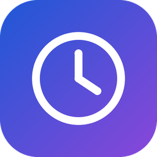

#  DesktopClock

A customizable and lightweight Windows digital clock for keeping the time, a countdown, or another time zone visible without opening a full calendar or timer app.
Built around a small overlay window that you can place wherever it fits your desktop, DesktopClock is designed to feel more like part of your workspace than a regular app window.

## 📸 Preview

## 🚀 Get Started

Download the latest version from the [Releases page](https://github.com/danielchalmers/DesktopClock/releases).

Choose the standard x64 installer (`.msi`) or the portable (`.zip`) version. ARM builds are also available.
